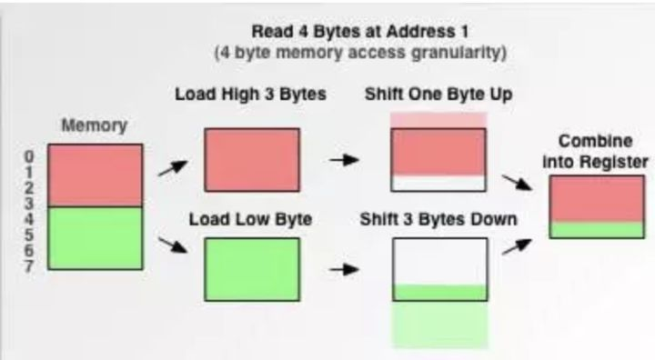
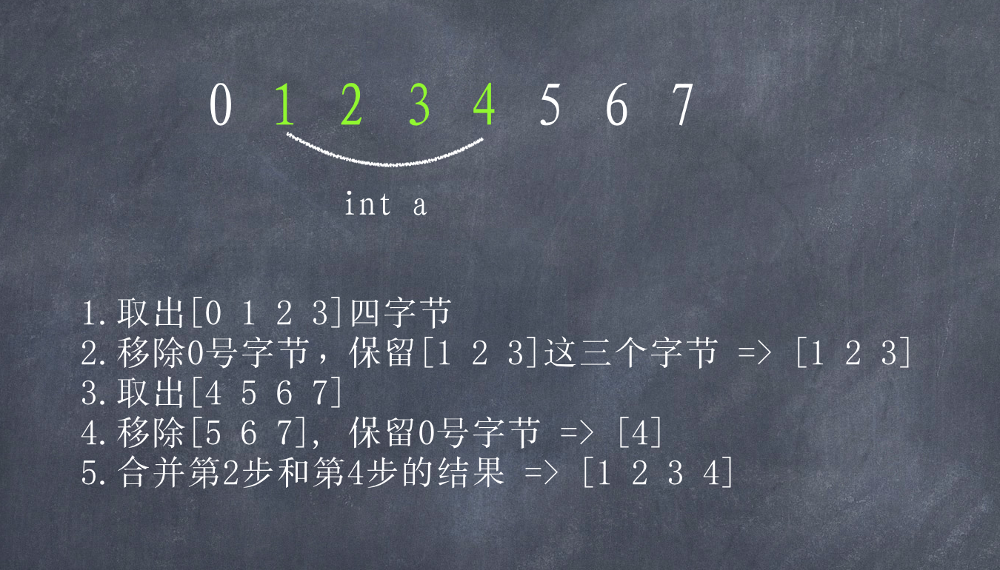
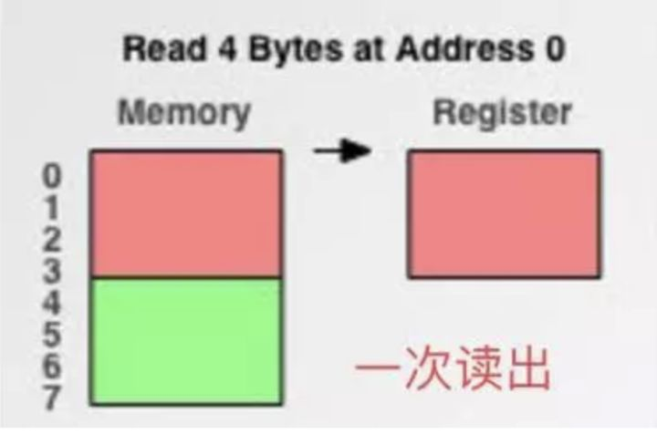
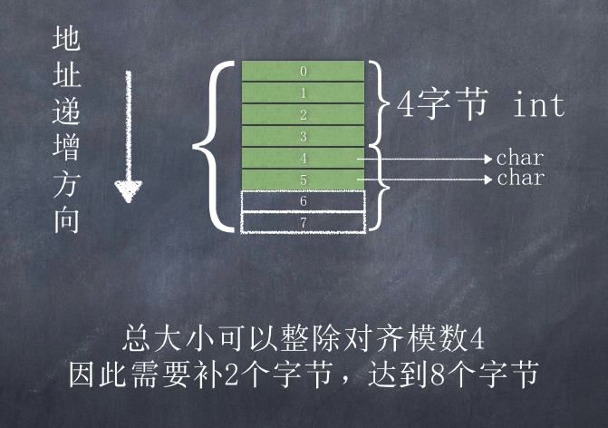
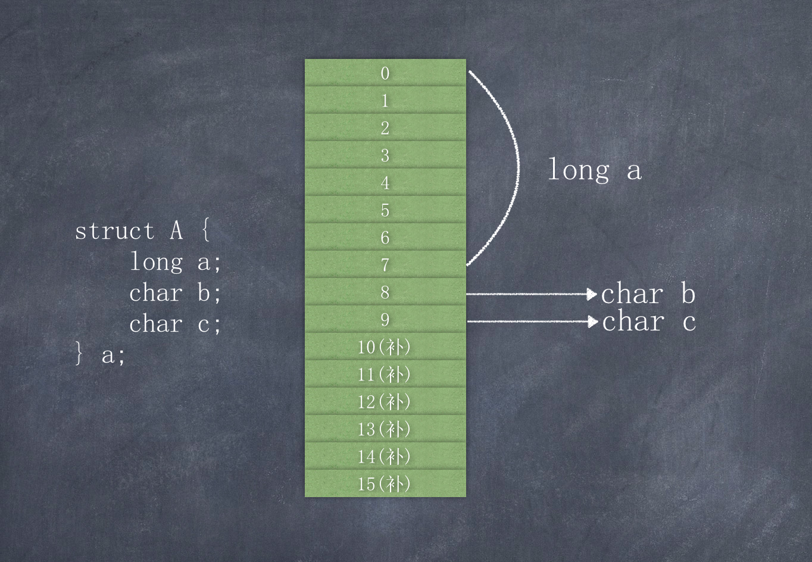
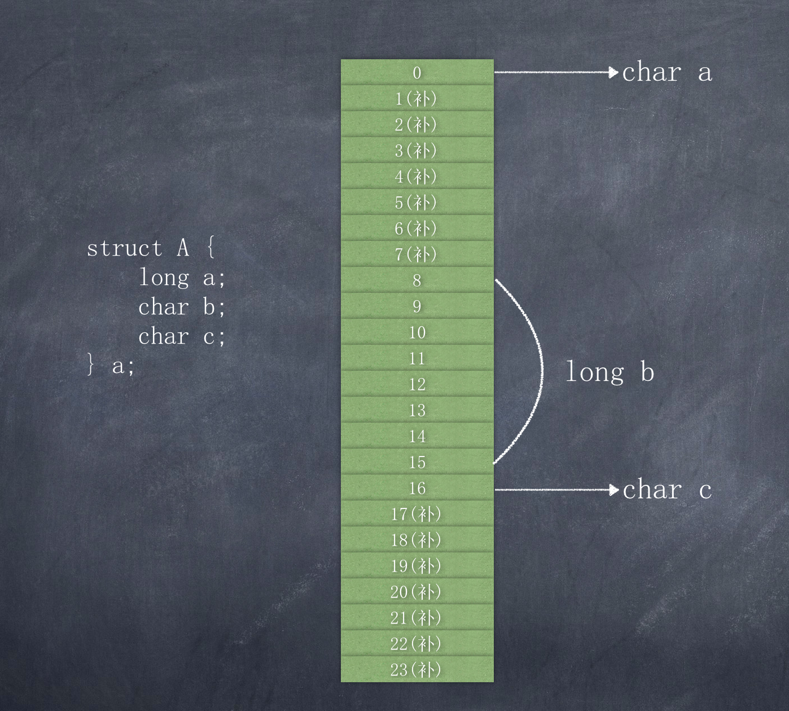
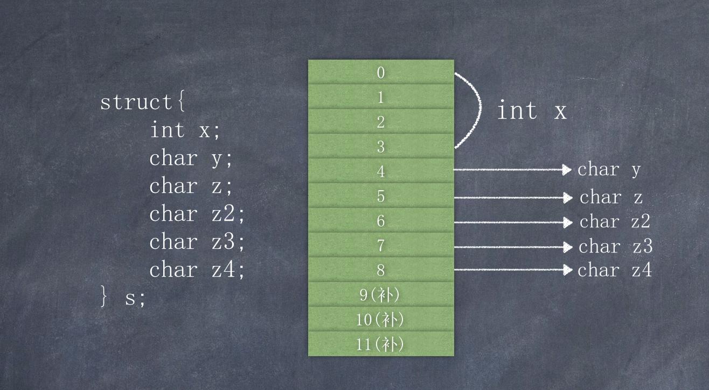

# 内存对齐

参考： 

- [https://zhuanlan.zhihu.com/p/30007037](https://zhuanlan.zhihu.com/p/30007037)
- [https://www.cnblogs.com/clover-toeic/p/3853132.html](https://www.cnblogs.com/clover-toeic/p/3853132.html)
- [https://blog.csdn.net/cclethe/article/details/79659590](https://blog.csdn.net/cclethe/article/details/79659590)

### 什么是内存对齐  

用一个例子带出这个问题，看下面的小程序，理论上，32位系统下，int占4byte，char占一个byte，那么将它们放到一个结构体中应该占4+1=5byte；但是实际上，通过运行程序得到的结果是8 byte，这就是内存对齐所导致的 

```c
#include<stdio.h>
struct{
    int x;
    char y;
} s;

int main() {
    printf("%d\n",sizeof(s);  // 输出8
    return 0;
}
```

现代计算机中内存空间都是按照 byte 划分的，从理论上讲似乎对任何类型的变量的访问可以从任何地址开始，但是实际的计算机系统对基本类型数据在内存中存放的位置有限制，它们会要求这些数据的首地址的值是某个数k（通常它为4或8）的倍数，这就是所谓的内存对齐。

### 为什么要进行内存对齐   
尽管内存是以字节为单位，但是大部分处理器并不是按字节块来存取内存的.它一般会以双字节,四字节,8字节,16字节甚至32字节为单位来存取内存，我们将上述这些存取单位称为内存存取粒度. 如果不按照平台要求对数据存放进行对齐，会带来存取效率上的损失。比如32位的Intel处理器通过总线访问(包括读和写)内存数据。每个总线周期从偶地址开始访问32位内存数据，内存数据以字节为单位存放。如果一个32位的数据没有存放在4字节整除的内存地址处，那么处理器就需要2个总线周期对其进行访问，即需要字节对齐的根本原因在于CPU访问数据的效率问题。  

假如没有内存对齐机制，数据可以任意存放，现在一个int变量存放在从地址1开始的联系四个字节地址中，该处理器去取数据时，要先从0地址开始读取第一个4字节块,剔除不想要的字节（0地址）,然后从地址4开始读取下一个4字节块,同样剔除不要的数据（5，6，7地址）,最后留下的两块数据合并放入寄存器.这需要做很多工作.  

    

  

现在有了内存对齐的，int类型数据只能存放在按照对齐规则的内存中，比如说0地址开始的内存。那么现在该处理器在取数据时一次性就能将数据读出来了，而且不需要做额外的操作，提高了效率。  

  

  

### 内存对齐规则  

一些概念：  
- 指定对齐值: 每个特定平台上的编译器都有自己的默认指定对齐值（也叫对齐模数，对齐系数）, gcc中默认#pragma pack(4)，可以通过预编译命令#pragma pack(n)，n = 1,2,4,8,16来改变这一系数.   
- 自身对齐值：比如char为1字节，short为2字节，int/float为4字节，double为8字节，结构体的自身对齐值是结构体成员中自身对齐值最大的那个值
- 有效对其值: 即 min(指定对齐值, 自身对齐值)，假设一个结构体中最长成员为long类型占8个字节，即这个结构体的自身对齐值为8，编译器指定对齐值为4，则有效对齐值为4。假设结构体中最长成员为short类型占2个字节，编译器指定对齐`#param pack(4)`，则有效对其值为2

有效对齐值N是最终用来决定数据存放地址方式的值。有效对齐N表示**对齐在N上**，即该数据的“存放起始地址`%N=0` 而数据结构中的数据变量都是按定义的先后顺序存放。第一个数据变量的起始地址就是数据结构的起始地址。结构体的成员变量要对齐存放，结构体本身也要根据自身的有效对齐值圆整(即结构体成员变量占用总长度为结构体有效对齐值的整数倍)

了解概念后，可以来看看内存对齐需要遵循的规则： 

1. 编译器在给结构体开辟空间时，首先找到结构体中最宽的基本数据类型作为结构体的自身对齐值，然后寻找内存地址能被该基本数据类型所整除的位置，作为结构体的首地址。将这个最宽的基本数据类型的大小作为上面介绍的指定对齐值(对齐模数)

2. 为结构体的一个成员开辟空间之前，编译器首先检查预开辟空间的首地址相对于结构体首地址的偏移是否是本成员大小的整数倍，若是，则存放本成员，反之，则在本成员和上一个成员之间填充一定的字节，以达到整数倍的要求，也就是将预开辟空间的首地址后移几个字节


```C
struct{
    int x;
    char y;
    char z;
} s;
```
上面这个结构体占用8个字节，按上面规则1可知int x点用`[0][1][2][3]`4个字节，char y占用`min(sizeof(char), 4)=1`的倍数，因此占用`[5]`字节, char z占用`[6]`字节  
再根据第二条规则，结构体总大小为**min(有效对齐值, 最大成员)** 的整数倍，`min(有效对齐值, 最大成员) = 4`，因此需要再被2个字节达到8个字节   



再来看一个示例： 

```c
#include <stdio.h>

struct A {
    long a; // 8字节  [0][1][2][3][4][5][6][7]
    char b; // 1字节  [8]
    char c; // 1字节  [9]
    // 补6字节 [补][补][补][补][补][补]
    // 共16字节
} a;

struct B {
    char a; // 1字节 [0]
    long b; // 补7字节，再占8字节 [补][补][补][补][补][补][补][8][9][10][11][12][13][14][15]
    char c; // 1字节 [16]
    // 以上共17字节
    // 由于模数为8，因此需要整除8，因此需被到24字节，24可整除8：[补][补][补][补][补][补][补]
} b;

struct{
    int x;
    char y;
    char z;
    char z2;
    char z3;
    char z4;
} s;

int main(int argc, const char * argv[]) {
    printf("%lu\n", sizeof(a)); // 16
    printf("%lu\n", sizeof(b)); // 24
    printf("%lu\n", sizeof(s)); // 12
    return 0;
}
```

  

  



